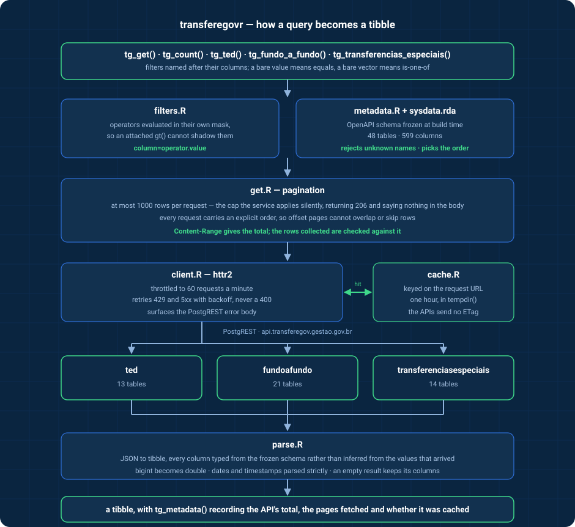

<!-- README.md is generated from README.Rmd. Please edit that file. -->


# transferegovr

<!-- badges: start -->

[](https://github.com/StrategicProjects/transferegovr/actions/workflows/R-CMD-check.yaml)
[](https://app.codecov.io/gh/StrategicProjects/transferegovr)
[](https://strategicprojects.github.io/transferegovr/)
[](https://www.repostatus.org/#active)
[](https://lifecycle.r-lib.org/articles/stages.html#experimental)
<!-- badges: end -->

An R interface to the open data APIs of **TransfereGov**, the Brazilian
federal government’s platform for transfers to states, municipalities
and civil society.

The platform publishes three APIs, covering **48 tables** in all:

| Module | Covers | Tables |
|----|----|----|
| `transferenciasespeciais` | Special transfers, created by Constitutional Amendment 105/2019 for individual parliamentary amendments | 14 |
| `fundoafundo` | Fund-to-fund transfers, from federal funds directly to state, district and municipal funds | 21 |
| `ted` | Decentralised credit between federal bodies (*termo de execução descentralizada*) | 13 |

All three are [PostgREST](https://postgrest.org) services, so this
package exposes their filtering, column selection and ordering directly,
rather than wrapping each table in a function of its own.

## Installation

``` r
# install.packages("pak")
pak::pak("StrategicProjects/transferegovr")
```

## Getting started

``` r
library(transferegovr)

tg_modules()
tg_tables("ted")
tg_fields("ted", "plano_acao")
```

`tg_get()` retrieves rows. Name each filter after the column it applies
to:

``` r
tg_get("ted", "plano_acao", aa_ano_plano_acao = 2024)
```

A bare value means “equals”, a bare vector means “is one of”, and the
operators from `tg_operators()` cover the rest:

``` r
tg_get(
  "ted", "plano_acao",
  aa_ano_plano_acao = gte(2024),
  sigla_unidade_descentralizada = c("CNPq", "CAPES"),
  tx_objeto_plano_acao = ilike("*pesquisa*"),
  .select = c("id_plano_acao", "vl_total_plano_acao", "dt_inicio_vigencia"),
  .order = "vl_total_plano_acao.desc",
  .limit = 20
)
```

Several conditions on one column go in a list, and the API combines them
with AND:

``` r
tg_get(
  "fundoafundo", "plano_acao",
  data_inicio_vigencia_plano_acao = list(gte("2024-01-01"), lt("2025-01-01"))
)
```

## Size first, download second

The service returns at most 1000 rows per request, and these tables are
not small — the largest holds over a million rows, which is more than a
thousand requests. Ask before you fetch:

``` r
tg_count("fundoafundo", "gestao_financeira_lancamentos")
#> [1] 1115444
```

`.limit` counts rows, not pages. Anything above 1000 is collected page
by page, in an explicit order so that the pages cannot overlap or skip
rows, and the total collected is checked against what the API reported:

``` r
plans <- tg_get("ted", "plano_acao", .limit = Inf)

tg_metadata(plans)$total_rows
tg_metadata(plans)$pages
```

## Types

Columns are typed from the API’s own schema rather than guessed, so a
column that happens to be entirely null on one page does not change
class on the next:

``` r
plans <- tg_get("ted", "plano_acao", .limit = 5)

class(plans$dt_inicio_vigencia)
#> [1] "Date"
class(plans$in_forma_execucao_direta)
#> [1] "logical"
```

## Caching

Responses are cached for an hour in the session’s temporary directory,
so nothing is written outside the session unless you ask for it. To keep
them between sessions:

``` r
tg_cache_dir(tools::R_user_dir("transferegovr", "cache"))
```

or set `TRANSFEREGOVR_CACHE_DIR` in your `.Renviron`. `tg_cache_clear()`
empties it.

## How it works



Two things in that picture are worth stating plainly, because they are
where a naive client of these APIs loses data:

- **The 1000-row cap is silent.** Ask for more and the service returns
  1000 rows with a `206`, and nothing in the body says the result was
  cut short. Only `Content-Range` does. `.limit` counts rows and is met
  by fetching pages.
- **Offset pagination needs an order.** A Postgres query without
  `ORDER BY` has no defined row order, so page two can repeat page one
  and skip rows elsewhere. Every request this package sends carries an
  explicit order, and the rows collected are checked against the total
  the API reported.

## Column names are in Portuguese

Table names, column names and categorical values belong to the API and
are left as the government publishes them. The package’s own functions,
arguments and documentation are in English, with Portuguese aliases
(`tg_obter()`, `tg_contar()`, `tg_tabelas()`, `tg_campos()`) for the
exported verbs.

## Related

- [obrasgovr](https://github.com/StrategicProjects/obrasgovr) — the
  ObrasGov public works API.
- The TransfereGov platform also publishes daily CSV extracts of SICONV
  agreement data at
  <https://www.gov.br/transferegov/pt-br/ferramentas-gestao/dados-abertos/download-dados>.
  Those files are a separate source and are not covered by this package.

## Official documentation

- <https://docs.api.transferegov.gestao.gov.br/transferenciasespeciais/>
- <https://docs.api.transferegov.gestao.gov.br/fundoafundo/>
- <https://docs.api.transferegov.gestao.gov.br/ted/>
