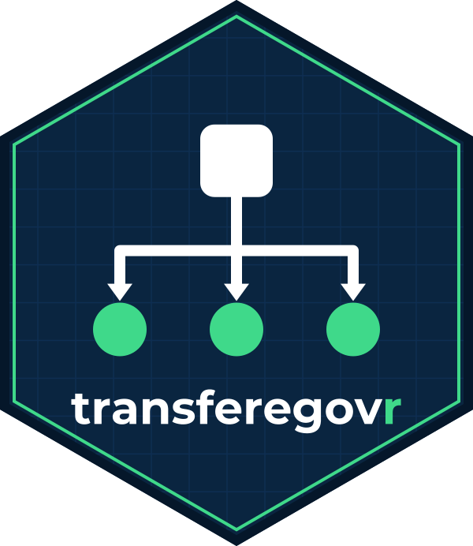

# transferegovr



An R interface to the open data APIs of **TransfereGov**, the Brazilian
federal government’s platform for transfers to states, municipalities
and civil society.

## What this package covers

The package targets the public API host,
`api-publica.transferegov.gestao.gov.br`, which publishes three modules
and **55 tables** in all:

| Module | Covers | Tables |
|----|----|----|
| `especiais` | Special transfers, created by Constitutional Amendment 105/2019 for individual parliamentary amendments | 20 |
| `fundoafundo` | Fund-to-fund transfers, from federal funds directly to state, district and municipal funds | 20 |
| `parcerias` | Partnership management: programs, proposals, partnerships, their financial execution and bank statements | 15 |

Every table in the three published data models is reachable. Where the
API folds a child table into its parent rather than giving it an
endpoint of its own, it arrives as a list column — 5 of them in
`fundoafundo`, 13 in `parcerias` — and `tg_fields(nested = )` describes
what is inside.

### What it does not cover

- **`ted`**, decentralized credit between federal bodies (*termo de
  execução descentralizada*), 13 tables. It has not been published on
  the public API host; it exists only on the older
  `api.transferegov.gestao.gov.br` service, which this package no longer
  uses.
- **The older PostgREST endpoints** for special and fund-to-fund
  transfers on that same host. They are still up and still answer, but
  they are a different and largely superseded contract — different
  column names, a handful of columns each way, and a
  `historico_pagamento_especial` table that the new service does not
  carry.
- **SICONV agreement data**, published as daily CSV extracts at
  <https://www.gov.br/transferegov/pt-br/ferramentas-gestao/dados-abertos/download-dados>.
  A separate source, not an API.

## Installation

``` r

# install.packages("pak")
pak::pak("StrategicProjects/transferegovr")
```

## Getting started

``` r

library(transferegovr)

tg_modules()
tg_tables("parcerias")
tg_fields("parcerias", "proposta")
tg_params("parcerias", "proposta")
```

[`tg_get()`](https://strategicprojects.github.io/transferegovr/reference/tg_get.md)
retrieves rows. Each filter is named after one of the endpoint’s own
query parameters, and parameters combine with AND:

``` r

tg_get(
  "parcerias", "proposta",
  sg_uf_recebedor = "PE",
  situacao_proposta = "Aprovada",
  .limit = 20
)
```

That is the whole filtering vocabulary. These services compare for
equality and nothing else — no greater-than, no pattern match, no “is
one of” — and they publish no ordering or column-selection parameter.
[`tg_params()`](https://strategicprojects.github.io/transferegovr/reference/tg_params.md)
lists what each table accepts, including the permitted values of the
enumerated parameters.

## A typo must not look like an answer

These services **ignore a query parameter they do not recognize** and
answer `200` with the whole table. Misspell `situacao_proposta` and you
get 88,666 rows where the filter would have given 84,258 — a plausible
number, quietly wrong.

So every parameter name is checked against the packaged schema before a
request goes out:

``` r

tg_count("parcerias", "proposta", in_situacao_proposta = "Aprovada")
#> Error in `tg_count()`:
#> ! Unknown filter: "in_situacao_proposta".
#> ✖ The API ignores a parameter it does not recognize and returns every row, so
#>   this would look like a query that matched nothing in particular.
#> ℹ Did you mean "situacao_proposta"?
```

Enumerated values are checked the same way, before the round trip rather
than after it.

## Size first, download second

The services return at most 200 rows per request, and these tables are
not small. Ask before you fetch:

``` r

tg_count("especiais", "meta_especiais")
#> [1] 156060
```

`.limit` counts rows, not pages. Anything above 200 is collected page by
page, and the total collected is checked against what the API reported:

``` r

metas <- tg_get("especiais", "meta_especiais", .limit = Inf)

tg_metadata(metas)$total_rows
tg_metadata(metas)$pages
```

## Types

Columns are typed from the API’s own schema rather than guessed, so a
column that happens to be entirely null on one page does not change
class on the next:

``` r

proposals <- tg_get("parcerias", "proposta", .limit = 5)

class(proposals$dt_proposta)
#> [1] "Date"
class(proposals$intervenientes_proposta)
#> [1] "list"
```

## Freshness and caching

Each module reports when it was last loaded, which is the only freshness
signal these APIs give — they send no `ETag`, `Cache-Control` or
`Last-Modified`:

``` r

tg_updated_at("parcerias")
#> [1] "2026-08-03 UTC"
```

Responses are cached for an hour in the session’s temporary directory,
so nothing is written outside the session unless you ask for it. To keep
them between sessions:

``` r

tg_cache_dir(tools::R_user_dir("transferegovr", "cache"))
```

or set `TRANSFEREGOVR_CACHE_DIR` in your `.Renviron`.
[`tg_cache_clear()`](https://strategicprojects.github.io/transferegovr/reference/tg_cache_clear.md)
empties it.

## How it works


Two things in that picture are where a naive client of these APIs loses
data:

- **An unrecognized parameter is ignored, not rejected.** The request
  succeeds and returns everything. Validating names client-side is the
  only defense, which is why the packaged schema freezes the parameter
  list and not just the columns.
- **Repeating a parameter does not combine conditions.** The service
  keeps the last occurrence and discards the rest without saying so, so
  the package refuses a repeated or multi-valued filter rather than
  sending one.

Page order is the server’s — these APIs publish no ordering parameter —
so it was verified rather than assumed: the same rows come back in the
same sequence across page sizes, across repeated calls, 100,000 rows
deep, on tables with no key, and on tables with nested columns.
`tests/testthat/test-live.R` keeps checking it.

## Column names are in Portuguese

Table names, column names, parameter names and categorical values belong
to the API and are left as the government publishes them. The package’s
own functions, arguments and documentation are in English, with
Portuguese aliases
([`tg_obter()`](https://strategicprojects.github.io/transferegovr/reference/tg_get.md),
[`tg_contar()`](https://strategicprojects.github.io/transferegovr/reference/tg_count.md),
[`tg_tabelas()`](https://strategicprojects.github.io/transferegovr/reference/tg_tables.md),
[`tg_campos()`](https://strategicprojects.github.io/transferegovr/reference/tg_fields.md),
[`tg_parametros()`](https://strategicprojects.github.io/transferegovr/reference/tg_params.md),
[`tg_atualizado_em()`](https://strategicprojects.github.io/transferegovr/reference/tg_updated_at.md))
for the exported verbs.

## Related

- [obrasgovr](https://github.com/StrategicProjects/obrasgovr) — the
  ObrasGov public works API.

## Official documentation

- <https://api-publica.transferegov.gestao.gov.br/especiais/docs>
- <https://api-publica.transferegov.gestao.gov.br/fundoafundo/docs>
- <https://api-publica.transferegov.gestao.gov.br/parcerias/docs>
