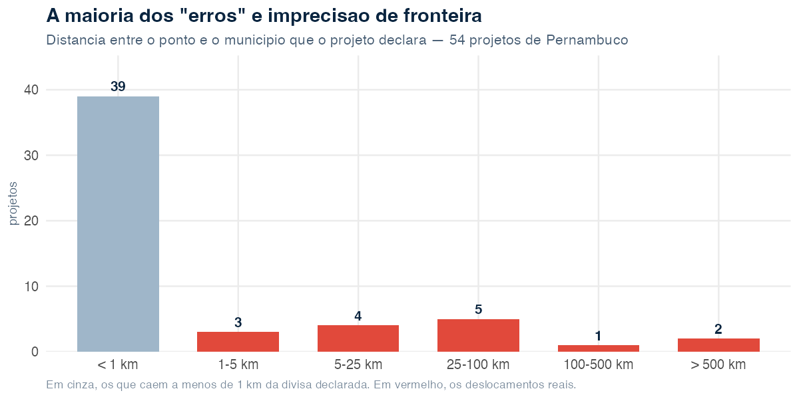

```{r, include = FALSE}
knitr::opts_chunk$set(collapse = TRUE, comment = "#>", eval = FALSE)
```

*O que dois sistemas federais dizem sobre o mesmo território — e o que eles não
conseguem dizer.*

> **Sobre esta análise.** Todos os números vêm de extrações feitas em **31 de julho
> de 2026** das APIs de dados abertos do TransfereGov e do ObrasGov. O código que
> os produz está reproduzido ao longo do texto. Os dados são atualizados
> diariamente pelo governo federal; refazer a extração em outra data produzirá
> números diferentes, e é esperado que produza.

Dois sistemas do governo federal registram dinheiro que desce para Pernambuco. O
**TransfereGov** cuida das transferências — o repasse em si, quem manda, quem
recebe, quanto. O **ObrasGov** cuida do que é construído com ele — a obra, o
prazo, e, desde 2021, o ponto no mapa onde ela deveria estar.

Cruzar os dois não é trivial, porque não existe chave comum: são cadastros
distintos, com identificadores próprios. O que os liga é o território — o código
IBGE do município. É por aí que este texto anda.

O retrato que sai não é o de um sistema quebrado. É o de dois sistemas que
funcionam razoavelmente bem naquilo que cobram de si mesmos, e que quase não
cobram justamente a informação que permitiria fiscalizá-los.

---

## O tamanho da coisa

```{r}
library(obrasgovr)
library(dplyr)

projetos <- get_projects(uf_principal = "PE", page_size = 200, all_pages = TRUE)

valor_previsto <- function(x) {
  if (length(x) == 0) return(NA_real_)
  sum(vapply(x, function(y) as.numeric(y$vl_investimento_previsto), numeric(1)),
      na.rm = TRUE)
}

projetos <- projetos |>
  mutate(valor = vapply(investimentos_previstos, valor_previsto, numeric(1)))

projetos |>
  group_by(situacao) |>
  summarise(projetos = n(),
            bilhoes = round(sum(valor, na.rm = TRUE) / 1e9, 2)) |>
  arrange(desc(projetos))
#> # A tibble: 6 × 3
#>   situacao    projetos bilhoes
#>   <chr>          <int>   <dbl>
#> 1 Concluída       2262    6.8
#> 2 Cadastrada      1961   45.09
#> 3 Em execução      974   11.31
#> 4 Cancelada        204    0.36
#> 5 Inacabada         44    0.24
#> 6 Paralisada        32    0.17
```

São **5.477 projetos** com Pernambuco como unidade federativa principal e
**R$ 63,96 bilhões** em investimento previsto.

O primeiro número que incomoda está na segunda linha. **R$ 45,09 bilhões — 70% de
todo o valor — estão em projetos com situação "Cadastrada"**, ou seja, que ainda
não começaram. Os 2.262 projetos já concluídos somam R$ 6,8 bilhões, pouco mais
de um décimo do total. O que existe em Pernambuco, no papel, é sobretudo promessa.

Quatro órgãos concentram 77% do valor:

| Órgão responsável | Projetos | R$ bi |
|---|---:|---:|
| Ministério da Integração e do Desenvolvimento Regional | 143 | 22,9 |
| Companhia Brasileira de Trens Urbanos | 26 | 11,1 |
| Ministério da Economia | 2.117 | 8,8 |
| DNIT | 66 | 6,6 |

A assimetria é o dado. O MIDR movimenta R$ 22,9 bilhões em 143 projetos — R$ 160
milhões cada. O Ministério da Economia movimenta R$ 8,8 bilhões espalhados por
2.117 projetos — R$ 4,2 milhões cada. São dois regimes de política pública
diferentes convivendo no mesmo cadastro, e qualquer média que os junte não
descreve nenhum dos dois.

## O ritmo


O cadastro acelerou de forma acentuada: de 123 projetos em 2021 para 3.059 em
2025. Mas o valor não acompanha o volume. Em 2021, 123 projetos carregavam
R$ 19,3 bilhões; em 2025, 3.059 projetos carregaram R$ 9,6 bilhões. O sistema
passou a registrar muito mais coisa, muito menor.

Duas ressalvas antes de ler isso como tendência. O ObrasGov começou a operar em
2021, então o primeiro ano não é um ano de política pública, é o ano em que o
estoque anterior entrou no sistema — o que explica o valor alto concentrado em
poucos registros. E 2026 está incompleto: a extração vai até 30 de julho.

## O calendário que não fecha

Aqui a análise para de ser sobre Pernambuco e passa a ser sobre o sistema.

```{r}
hoje <- Sys.Date()

vencidos <- projetos |>
  filter(situacao %in% c("Em execução", "Cadastrada"),
         !is.na(dt_final_prevista),
         dt_final_prevista < hoje)

nrow(vencidos)
#> [1] 1086
sum(vencidos$valor, na.rm = TRUE) / 1e9
#> [1] 39.42
```

**1.086 projetos passaram da data prevista de conclusão e continuam listados como
"em execução" ou "cadastrada". Somam R$ 39,42 bilhões** — quase dois terços de
tudo que Pernambuco tem registrado.

E não é atraso recente:

| Tempo desde o prazo vencido | Projetos |
|---|---:|
| menos de 1 ano | 337 |
| 1 a 2 anos | 151 |
| 2 a 5 anos | 365 |
| 5 a 10 anos | 169 |
| mais de 10 anos | 64 |

**Sessenta e quatro projetos estão mais de dez anos além do prazo** e seguem sem
qualquer marcação de conclusão, cancelamento ou paralisação. Não é possível
distinguir, pelos dados, uma obra genuinamente travada de um registro que
ninguém voltou para atualizar. Essa indistinção é, ela própria, o achado.

O motivo é o campo que quase ninguém preenche:

```{r}
sum(!is.na(projetos$dt_final_efetiva))
#> [1] 43
```

**Dos 5.477 projetos, 43 têm data efetiva de conclusão** — 0,8%. Mesmo entre os
2.262 marcados como "Concluída", a data real de entrega é exceção. O ObrasGov
registra bem o que se pretende fazer e quase não registra o que foi feito. Sem
isso, nenhum indicador de prazo é calculável: não dá para dizer se uma obra
atrasa, quanto atrasa, nem se o atraso piorou.

Nos 43 casos em que dá para comparar, 8 foram entregues depois do previsto
(18,6%). É uma amostra pequena demais para generalizar, e vale dizê-lo em vez de
transformar em manchete.

Há ainda o resíduo técnico. **Nove projetos têm data prevista de término anterior
à de início** — vários com fim em `1899-12-30` ou `1900-01-01`, que são o marco
zero de planilhas eletrônicas. É a assinatura de um campo vazio que virou data ao
atravessar uma exportação.

## Onde as obras dizem estar

Desde 2021 o ObrasGov aceita coordenadas. Isso permite algo que a maioria dos
cadastros públicos brasileiros não permite: **testar a informação contra o
território**. Se um projeto se declara em Petrolina e seu ponto cai no Amazonas,
não é preciso auditar em campo para saber que algo está errado.

O teste é ponto-em-polígono contra a malha municipal do IBGE:

```{r}
library(sf)
library(geobr)
library(tidyr)

pins <- projetos |>
  select(id_projeto_investimento, desc_nome, pins) |>
  filter(lengths(pins) > 0) |>
  unnest_longer(pins) |>
  mutate(
    lat = as.numeric(vapply(pins, function(x) x$latitude, character(1))),
    lon = as.numeric(vapply(pins, function(x) x$longitude, character(1)))
  ) |>
  filter(!is.na(lat), !is.na(lon))

municipios <- read_municipality(year = 2022) |> st_make_valid()

onde_caem <- pins |>
  st_as_sf(coords = c("lon", "lat"), crs = 4326, remove = FALSE) |>
  st_join(municipios[, c("code_muni", "name_muni", "abbrev_state")],
          join = st_within)
```

Antes dos resultados, a cobertura. **5.417 dos 5.477 projetos (98,9%) têm ao menos
um ponto** — adesão alta, digna de nota. São 8.651 registros de ponto, dos quais
**505 vêm sem latitude ou longitude**: o ponto foi criado e ficou vazio. Restam
8.146 coordenadas utilizáveis.


**141 pontos caem em outro estado**, distribuídos assim:

| Estado onde o ponto cai | Pontos |
|---|---:|
| Paraíba | 130 |
| Ceará | 6 |
| Amazonas | 2 |
| Alagoas | 1 |
| Bahia | 1 |
| Rio Grande do Norte | 1 |

Afetam **16 projetos**. A concentração na Paraíba tem explicação geográfica
banal — a divisa PE–PB corta uma região densa de pequenos municípios, e erros de
poucos quilômetros atravessam a fronteira. Os outros não têm essa desculpa. O
projeto `15853.26-85`, "Pavimentação de estradas vicinais", declara-se em
Pernambuco e tem ponto em **Manicoré, no Amazonas — 2.643 km de distância**. O
`123265.26-04`, do MIDR, cai em Morro do Chapéu, na Bahia, a 582 km.

**Outros 52 pontos não caem em município nenhum**: estão no mar. Quarenta deles
a menos de 2 km da linha de costa, o que é consistente com obra litorânea e
imprecisão do polígono. Mas seis estão a mais de 18 km da terra, e um — do
projeto `40077.26-04`, em execução — está a **346 km da costa, em pleno
Atlântico**.

Vale registrar o que *não* é erro. Sete pontos que um teste ingênuo de caixa
envolvente acusaria caem em **Fernando de Noronha**, a 361 km do continente. O
arquipélago é distrito estadual de Pernambuco, e os pontos estão certos. Foi
preciso o polígono municipal real para não transformar Noronha em anomalia — um
lembrete de que o filtro grosseiro erra para os dois lados.

## A manchete que não se sustenta

O teste mais severo é comparar o ponto com o município que o próprio projeto
declara. Ali, **179 dos 8.089 pontos comparáveis (2,2%) caem fora de todos os
municípios declarados**, afetando 54 projetos.

Seria uma boa manchete. Mas a distância desmonta:



**Trinta e nove dos 54 projetos estão a menos de um quilômetro** da divisa que
declaram. Isso não é obra no lugar errado: é a resolução do polígono municipal
encontrando a resolução da coordenada. Recife e Jaboatão dos Guararapes trocam de
lado o tempo todo nessa faixa, e nenhum gestor precisa fazer nada a respeito.

O deslocamento real são **15 projetos** — 0,3% dos que têm ponto. Destes, dois
passam de 500 km e um de 200 km. Em valor, os projetos com ponto deslocado somam
**R$ 284,8 milhões, ou 0,4%** dos R$ 63,96 bilhões do estado.

Essa é a conclusão honesta, e ela é menos vistosa do que a que os 2,2% sugeriam.
A qualidade das coordenadas do ObrasGov em Pernambuco é **boa**. O problema não é
volume, é natureza: um punhado de registros aponta para o estado errado, e não há
no sistema nada que os impeça de existir. Uma validação de fronteira no momento
do cadastro — a mesma que fizemos aqui em três linhas — barraria todos os quinze.

Verificamos também se a origem da geometria explica o erro. Não explica de forma
conclusiva: "Vetorização" erra em 3 de 152 projetos (2,0%) e "Par de Lat/Long" em
51 de 5.308 (1,0%). A diferença existe, mas 3 casos não sustentam recomendação.

## O contraste que interessa

Do outro lado, o TransfereGov não tem coordenada nenhuma. Tem UF e código IBGE do
município — e os dois nunca se contradizem:

```{r}
library(transferegovr)

planos <- tg_get("fundoafundo", "plano_acao", .limit = Inf)

uf_por_codigo <- c("26" = "PE", "25" = "PB", "27" = "AL", "29" = "BA")  # etc.

planos |>
  filter(!is.na(uf_ente_recebedor_plano_acao),
         !is.na(codigo_ibge_municipio_ente_recebedor_plano_acao)) |>
  mutate(
    codigo = sprintf("%07.0f", codigo_ibge_municipio_ente_recebedor_plano_acao),
    prefixo = substr(codigo, 1, 2),
    coerente = uf_ente_recebedor_plano_acao == uf_por_codigo[prefixo]
  ) |>
  count(coerente)
#> # A tibble: 1 × 2
#>   coerente     n
#>   <lgl>    <int>
#> 1 TRUE     25971
```

**Zero inconsistências em 25.971 planos de ação.** Nenhum prefixo de código IBGE
inválido. Nenhum município com dois nomes diferentes. A localização declarada no
TransfereGov é internamente coerente do começo ao fim.

A leitura fácil seria "TransfereGov é melhor". A leitura correta é outra: **o
TransfereGov não pode errar assim porque não pede o dado que erra**. Ele registra
qual município recebe — informação administrativa, validada contra uma tabela
fechada, praticamente impossível de contradizer. O ObrasGov pede onde a obra
está, informação do mundo físico, que exige alguém em campo com um GPS. Uma é
verificável no cadastro; a outra só é verificável no território.

O ObrasGov, ao aceitar coordenadas, assumiu o risco de estar visivelmente errado.
É por isso que é possível escrever este parágrafo sobre ele e não sobre o outro.
**Cadastro que não pode ser contestado não é cadastro melhor — é cadastro que
pede menos.**

Do lado do dinheiro, os planos fundo a fundo com recebedor em Pernambuco:

| Ano de início da vigência | Planos | R$ milhões |
|---|---:|---:|
| 2020 | 219 | 199,6 |
| 2021 | 15 | 45,7 |
| 2022 | 27 | 453,4 |
| 2023 | 392 | 391,6 |
| 2024 | 8 | 70,2 |
| 2025 | 197 | 588,2 |
| 2026 | 9 | 43,5 |
| 2029 | 1 | 0,7 |

A oscilação entre 392 planos em 2023 e 8 em 2024 é o efeito dos ciclos de adesão
a programas, não uma queda de repasse. E a última linha é o mesmo tipo de resíduo
das datas de 1899: **um plano com início de vigência em 2029**.

## O que um gestor faz com isso

Três coisas são acionáveis hoje, e todas são baratas:

1. **Validar a coordenada contra o município na hora do cadastro.** Os 15
   projetos genuinamente deslocados seriam barrados por um `st_within` — o mesmo
   que roda em segundos neste artigo. É a diferença entre um cadastro que aceita
   e um que confere.
2. **Tratar data efetiva como obrigatória na conclusão.** Enquanto 0,8% dos
   projetos tiverem data real de entrega, nenhum indicador de prazo do estado é
   calculável, e os 1.086 projetos vencidos continuarão indistinguíveis entre
   "travado" e "desatualizado".
3. **Fazer uma varredura dos vencidos há mais de cinco anos.** São 233 projetos.
   Não é volume que exija sistema: é volume que cabe numa planilha e numa reunião.

E uma coisa não é acionável, mas deve ser dita: **a análise acima só foi possível
porque o ObrasGov publica coordenada**. A crítica que este texto faz a ele é
mérito dele. Um sistema que publicasse menos apareceria melhor aqui.

---

## Limites desta análise

- **Recorte.** Só projetos com `uf_principal = "PE"`. Obras em outros estados que
  atendam Pernambuco, ou multiestaduais registradas sob outra UF, ficam de fora.
- **A malha é de 2022.** Municípios criados ou com divisa alterada depois disso
  podem gerar divergência que não é erro do cadastro.
- **"Fora do município declarado" não é prova de erro de coordenada.** Pode ser
  erro do município declarado. Os dados não permitem dizer qual dos dois campos
  está errado — apenas que eles se contradizem.
- **O ponto marca o projeto, não necessariamente a obra.** Um projeto linear —
  estrada, adutora — é representado por pontos, e a distância a uma sede
  municipal não mede erro nesses casos.
- **Valor é investimento previsto**, informado no cadastro. Não é empenho, não é
  pago, e não é liquidado.

## Reprodução

Os dados vêm de duas APIs públicas, sem autenticação. Os dois pacotes se instalam com [pak](https://pak.r-lib.org):

```{r}
pak::pak(c("StrategicProjects/obrasgovr", "StrategicProjects/transferegovr"))
```

A malha municipal vem do [geobr](https://ipeagit.github.io/geobr/). A extração
completa deste artigo baixa cerca de 5,5 mil projetos e 9,7 mil geometrias —
alguns minutos, respeitando o limite de requisições que os dois pacotes já
aplicam sozinhos.
